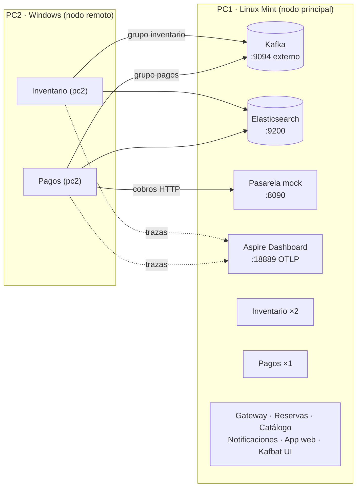

# Guía paso a paso: TaquillaEDA en dos PCs y demostración de tolerancia a fallos

Esta guía parte de cero: tienes **todo el sistema corriendo en el PC1 (Linux Mint)** y vas a sumar un **PC2 (Windows)** con una réplica más de **Inventario** y otra de **Pagos**. Después vas a tumbar servicios en un PC y mostrar que el otro toma el trabajo, sin perder reservas y sin sobreventa.

> **Datos de este montaje:** IP del PC1 = `192.168.2.7` (la de tu `.env`). Carpeta del proyecto en el PC2 = `C:\Users\nicod\Downloads\taquilla-codigo\taquilla-codigo`. La IP del PC2 (`192.168.2.20`) es solo un ejemplo: no se configura en ningún lado; solo la verás en la columna HOST de `ver-grupos.sh`.
> **Si la IP del PC1 cambia** (otro día u otra red), cámbiala en el `.env` de **los dos** PCs (paso 3.1 y 4.3) y en los comandos de esta guía.

## ▶ Ya tienes los dos PCs corriendo: empieza aquí

Si el PC1 tiene el sistema completo y el PC2 ya muestra `inventario` y `pagos` en `healthy`, **salta a la [sección 5](#5-verificar-que-los-dos-pcs-trabajan-juntos)** y luego a los escenarios (7, 8 y 9). Las secciones 2–4 solo hacen falta para montar todo de nuevo.

Dos reglas para no repetir el problema del arranque:

1. **En el PC2, siempre con `-f docker-compose.nodo-remoto.yml`.** Un `docker compose up` sin `-f` levanta el sistema completo en Windows (Kafka, Kibana, pasarela…), que no debe estar ahí. Si pasa: Ctrl+C y `docker compose down -v` (**solo en el PC2**).
2. **Siempre con `-d`.** Sin `-d` la consola se queda mostrando logs para siempre.

Para escribir menos, en **cada ventana nueva** de PowerShell del PC2 pega primero:

```powershell
cd C:\Users\nicod\Downloads\taquilla-codigo\taquilla-codigo
function nodo { docker compose -f docker-compose.nodo-remoto.yml @args }
```

Desde ahí, `nodo ps` = `docker compose -f docker-compose.nodo-remoto.yml ps` (y así con cualquier comando). Si dudas si el atajo está creado, usa el comando completo.

Como el PC2 ya tiene las imágenes, para levantarlo otra vez **no uses `--build`**: `nodo up -d`.

**Forma más fácil (cualquier Windows, incluso varios a la vez):** doble clic en `iniciar-nodo.cmd`, que está en la carpeta del proyecto. Pide la IP del PC principal y el nombre del nodo, prueba la conexión, levanta y verifica todo solo. Paso a paso en **[`ENCENDER-NODO-WINDOWS.md`](ENCENDER-NODO-WINDOWS.md)**.

---

## Índice

0. [Cómo funciona (lo que vas a explicar)](#0-cómo-funciona-lo-que-vas-a-explicar)
1. [Qué cambió en el proyecto](#1-qué-cambió-en-el-proyecto)
2. [Red: conectar los dos PCs](#2-red-conectar-los-dos-pcs)
3. [PC1 (Linux Mint): prepararlo como nodo principal](#3-pc1-linux-mint-prepararlo-como-nodo-principal)
4. [PC2 (Windows): instalar y levantar el nodo remoto](#4-pc2-windows-instalar-y-levantar-el-nodo-remoto)
5. [Verificar que los dos PCs trabajan juntos](#5-verificar-que-los-dos-pcs-trabajan-juntos)
6. [Preparar la pantalla para la demo](#6-preparar-la-pantalla-para-la-demo)
7. [Escenario 1: failover de Inventario](#7-escenario-1-failover-de-inventario)
8. [Escenario 2: failover de Pagos](#8-escenario-2-failover-de-pagos)
9. [Escenario 3: caída del PC2 bajo carga](#9-escenario-3-caída-del-pc2-bajo-carga)
10. [Guion sugerido para la sustentación](#10-guion-sugerido-para-la-sustentación)
11. [Checklist del día de la sustentación](#11-checklist-del-día-de-la-sustentación)
12. [Solución de problemas](#12-solución-de-problemas)
13. [Preguntas probables del jurado](#13-preguntas-probables-del-jurado)
14. [Chuleta de comandos](#14-chuleta-de-comandos)

---

## 0. Cómo funciona (lo que vas a explicar)



La idea clave: **los servicios no se hablan entre sí, y nadie "le avisa" al PC2 que debe trabajar.**

- Cada tópico tiene **6 particiones**. Todas las réplicas de Inventario (2 en el PC1 + 1 en el PC2) están en el **mismo grupo de consumidores** `inventario`; las de Pagos (1 + 1), en el grupo `pagos`.
- El **coordinador del grupo en Kafka** reparte las particiones entre los miembros vivos. Cada réplica envía *heartbeats*.
- Si una réplica **se apaga ordenadamente**, avisa que se va (*LeaveGroup*) y Kafka reasigna sus particiones en **1–3 segundos**.
- Si una réplica **muere de golpe** (proceso matado, cable desconectado, PC apagado), Kafka deja de recibir heartbeats y, al cumplirse el `session.timeout` (**30 s** en este proyecto), la saca del grupo y reasigna sus particiones.
- Los eventos que llegaron mientras tanto **esperan en Kafka** (se ve como *lag*). El nuevo dueño retoma desde el último offset confirmado. Si reprocesa algo, el **consumidor idempotente** (índices `inventario-procesados` y `pagos-procesados`) y la **concurrencia optimista** de Elasticsearch evitan duplicados y sobreventa.

Reparto esperado con los dos PCs:

| Grupo | Tópicos que consume | Particiones | Miembros | Particiones por miembro |
|---|---|---|---|---|
| `inventario` | `catalogo.v1`, `reservas.v1` | 12 | 3 (2 en PC1, 1 en PC2) | 4 |
| `pagos` | `inventario.v1`, `reservas.v1` | 12 | 2 (1 en PC1, 1 en PC2) | 6 |

> **Detalle importante para la demo:** `reservas.v1` usa como clave el **id de la localidad** (escritor único por localidad), así que **todas las reservas de una misma localidad las atiende la misma réplica de Inventario**. En cambio, `inventario.v1` usa el **id de la reserva**, así que **los cobros se reparten entre PC1 y PC2** casi por mitades. Por eso, para ver al PC2 trabajando en Inventario, reserva en localidades distintas o apaga el Inventario del PC1.

---

## 1. Qué cambió en el proyecto

Ya quedaron guardados en tu carpeta `taquilla-codigo`:

| Archivo | Cambio |
|---|---|
| `docker-compose.yml` | La `pasarela-mock` ahora se publica en el puerto **8090**, para que Pagos del PC2 cobre en la **misma pasarela** que el PC1. |
| `docker-compose.nodo-remoto.yml` | Ahora levanta **Inventario y Pagos** en el PC2 (antes solo Inventario). |
| `src/Pagos/Aplicacion/Pagos.cs` | Un log nuevo: `Reserva X: cobro de N APROBADO en el nodo pc2`. Así se ve en vivo **qué PC cobró** cada reserva. |
| `scripts/ver-grupos.sh` | Vista en vivo de qué PC atiende cada partición y cuánto *lag* hay. Es la pantalla principal de la demo. |
| `.env.example` | Variable `NOMBRE_NODO` (nombre del PC2 en logs, Kafbat UI y Aspire). |
| `README.md` | La sección 3.5 apunta a esta guía. |

---

## 2. Red: conectar los dos PCs

### 2.1 Ponerlos en la misma red

- **Recomendado: el hotspot de un celular** (o un router propio). Conecta **los dos PCs** a esa red.
- **Evita el Wi-Fi de la universidad**: casi siempre aísla a los equipos entre sí (*client isolation*) y el PC2 no podrá ver al PC1.
- Un cable Ethernet a un mismo router/switch también sirve.

### 2.2 Averiguar la IP del PC1 (Linux Mint)

```bash
ip -4 route get 1.1.1.1 | grep -oP 'src \K\S+'
```

Anota el resultado (ejemplo: `192.168.2.7`). También sirve `hostname -I` (la primera IP que **no** empiece por `172.`).

### 2.3 Averiguar la IP del PC2 (Windows)

En PowerShell:

```powershell
ipconfig
```

Busca el adaptador **Wi-Fi** (o Ethernet) → **Dirección IPv4** (ejemplo: `192.168.2.20`). Ignora los adaptadores `vEthernet (WSL)`.

### 2.4 Probar que se ven

Desde el **PC2** (PowerShell):

```powershell
ping 192.168.2.7
```

Debe responder. Si no responde, revisa que estén en la misma red (ver 2.1).

### 2.5 Firewall del PC1

Linux Mint trae `ufw` **desactivado** por defecto y, además, Docker publica sus puertos por fuera de `ufw`. Solo por si acaso:

```bash
sudo ufw status
# Si dice "Status: active" y el PC2 no conecta en el paso 4.4:
sudo ufw allow 9094,9200,8090,18889,8000,3000,8080/tcp
```

En Windows (PC2) no hay que abrir nada: el PC2 solo **sale** hacia el PC1.

---

## 3. PC1 (Linux Mint): prepararlo como nodo principal

Todo en una terminal, dentro de la carpeta del proyecto:

```bash
cd ~/Descargas/demo/taquilla-codigo
```

### 3.1 Configurar la IP en `.env`

Kafka necesita saber qué IP **anunciar** a los clientes que llegan desde fuera de Docker (el PC2). Eso lo define `IP_ANFITRION`.

```bash
# Crea .env si no existe
[ -f .env ] || cp .env.example .env

# Pone la IP actual del PC1 en IP_ANFITRION
IP=$(ip -4 route get 1.1.1.1 | grep -oP 'src \K\S+'); echo "IP del PC1: $IP"
grep -q '^IP_ANFITRION=' .env && sed -i "s/^IP_ANFITRION=.*/IP_ANFITRION=$IP/" .env || echo "IP_ANFITRION=$IP" >> .env

grep IP_ANFITRION .env        # debe mostrar IP_ANFITRION=192.168.2.7 (tu IP)
```

### 3.2 Aplicar los cambios

```bash
docker compose up -d --build
```

Esto reconstruye **Pagos** (por el log nuevo), recrea **Kafka** (para que anuncie la nueva IP) y la **pasarela** (para publicar el puerto 8090). Los datos se conservan. Tarda 1–3 minutos.

### 3.3 Verificar

```bash
docker compose ps                                        # todo "running (healthy)"; kafka-init "exited (0)"
docker compose exec kafka env | grep ADVERTISED          # debe contener EXTERNAL://192.168.2.7:9094
curl -s http://$IP:8090/config; echo                     # la pasarela responde por la IP de red
curl -s http://$IP:9200 | head -5                        # Elasticsearch responde por la IP de red
```

Si todo responde **usando la IP** (no `localhost`), el PC2 también podrá llegar.

### 3.4 (Solo si usarás la opción B del paso 4.2) Exportar las imágenes

```bash
docker save -o ~/taquilla-pc2.tar taquilla/inventario:1.0.0 taquilla/pagos:1.0.0
ls -lh ~/taquilla-pc2.tar     # ~250–350 MB
```

Hazlo **después** del paso 3.2, para que la imagen de Pagos incluya el log nuevo.

---

## 4. PC2 (Windows): instalar y levantar el nodo remoto

### 4.1 Instalar Docker Desktop

1. Abre **PowerShell como administrador** y ejecuta:
   ```powershell
   wsl --install
   ```
   Reinicia si lo pide.
2. Descarga e instala **Docker Desktop** desde <https://www.docker.com/products/docker-desktop/> (deja marcado **Use WSL 2**).
3. Abre Docker Desktop y espera a que abajo diga **Engine running**.
4. Comprueba en PowerShell (normal, no hace falta admin):
   ```powershell
   docker version
   docker compose version
   ```

El PC2 solo corre 2 servicios .NET: con los recursos por defecto de Docker Desktop es suficiente.

### 4.2 Llevar el proyecto al PC2

Elige **una** opción. En este montaje el proyecto quedó en `C:\Users\nicod\Downloads\taquilla-codigo\taquilla-codigo` (la carpeta que contiene `docker-compose.nodo-remoto.yml`). También sirve mandarlo como zip por WhatsApp (como **Documento**) y descomprimirlo.

#### Opción A: copiar el proyecto y construir en el PC2

Necesita internet la primera vez (descarga el SDK de .NET, ~1 GB).

- **Por USB o WhatsApp (zip):** copia la carpeta `taquilla-codigo` completa del PC1 al PC2.
- **Por Git:** en el PC1 haz `git add -A && git commit -m "Modo distribuido: Pagos en el nodo remoto" && git push`, y en el PC2 `git clone <url> C:\Users\nicod\Downloads\taquilla-codigo\taquilla-codigo`.

#### Opción B: cargar las imágenes ya construidas (sin compilar ni internet)

1. Copia por USB la carpeta `taquilla-codigo` **y** el archivo `taquilla-pc2.tar` (del paso 3.4).
2. En el PC2:
   ```powershell
   cd C:\Users\nicod\Downloads\taquilla-codigo\taquilla-codigo
   docker load -i D:\taquilla-pc2.tar        # ajusta la letra de la USB
   docker images "taquilla/*"                # deben aparecer inventario y pagos 1.0.0
   ```

> La opción B solo sirve si el PC2 es x86-64 (Intel/AMD), como casi todos los portátiles. Si es un Windows con procesador ARM (Snapdragon), usa la opción A.

### 4.3 Crear el `.env` del PC2

En el PC2, `IP_ANFITRION` es la **IP del PC1** (a dónde tiene que ir a buscar Kafka, Elasticsearch y la pasarela).

```powershell
cd C:\Users\nicod\Downloads\taquilla-codigo\taquilla-codigo
Set-Content -Path .env -Encoding ascii -Value "IP_ANFITRION=192.168.2.7", "NOMBRE_NODO=pc2"
Get-Content .env
```

> Si copiaste la carpeta completa del PC1, su `.env` ya trae la IP correcta del PC1: solo verifica con `Get-Content .env`.
> **No** crees el `.env` con `echo ... > .env` en PowerShell 5 ni lo guardes desde el Bloc de notas como "Unicode": queda en UTF-16 y Docker Compose no lo lee.

### 4.4 Probar que el PC2 llega a los puertos del PC1

```powershell
9094, 9200, 8090, 18889 | ForEach-Object {
  Test-NetConnection 192.168.2.7 -Port $_ -WarningAction SilentlyContinue |
    Select-Object RemotePort, TcpTestSucceeded
}
```

Los cuatro deben decir `True`:

| Puerto | Qué es | Si falla |
|---|---|---|
| 9094 | Kafka (listener externo) | Repite el paso 3.1–3.2 en el PC1 |
| 9200 | Elasticsearch | Firewall del PC1 (2.5) o misma red (2.1) |
| 8090 | Pasarela de pagos | En el PC1: `docker compose up -d pasarela-mock` |
| 18889 | Aspire (trazas) | No bloquea la demo, pero no verás las trazas del PC2 |

### 4.5 Levantar el nodo remoto

Para no escribir el `-f` cada vez, crea un atajo en la sesión de PowerShell (repítelo cada vez que abras una ventana nueva):

```powershell
cd C:\Users\nicod\Downloads\taquilla-codigo\taquilla-codigo
function nodo { docker compose -f docker-compose.nodo-remoto.yml @args }
```

Luego:

```powershell
nodo up -d --build     # Opción A (construye; la primera vez tarda 5–10 min)
nodo up -d             # Opción B (usa las imágenes cargadas con docker load)
```

### 4.6 Verificar en el PC2

```powershell
nodo ps                  # inventario y pagos "running (healthy)" tras ~30–60 s
nodo logs --tail 50      # busca "Particiones asignadas al grupo inventario" y "... al grupo pagos"
```

`healthy` significa que el contenedor del PC2 **sí alcanza** a Kafka y a Elasticsearch del PC1 (el health check lo comprueba).

---

## 5. Verificar que los dos PCs trabajan juntos

### 5.1 La vista en vivo (PC1)

```bash
bash scripts/ver-grupos.sh
```

Debes ver algo así:

```
=============== Grupo: inventario ===============
-- Miembros
   HOST               CLIENTE                    #PARTICIONES
   /192.168.2.20      inventario-pc2             4      <- PC2
   /172.18.0.11       inventario-3f2a9c1b7d4e    4      <- PC1 (réplica 1)
   /172.18.0.12       inventario-8e1d0a6c2b95    4      <- PC1 (réplica 2)
...
=============== Grupo: pagos ===============
-- Miembros
   /192.168.2.20      pagos-pc2                  6      <- PC2
   /172.18.0.13       pagos-b7c4e2a19f03         6      <- PC1
```

- `HOST` `172.x.x.x` = réplica del **PC1** (red interna de Docker). `HOST` con la IP de red del PC2 = réplica del **PC2**.
- La columna `LAG` de la sección *Particiones* debe estar en `0`.

### 5.2 Otras formas de verlo

| Dónde | Qué mirar |
|---|---|
| Kafbat UI: `http://192.168.2.7:8080` (desde cualquiera de los dos PCs) | *Consumers* → `inventario` (3 miembros) y `pagos` (2 miembros), con su *lag* |
| Aspire Dashboard: `http://192.168.2.7:18888` | *Structured logs* / *Traces*: aparecen `inventario` y `pagos` con la instancia `pc2` |
| App web: `http://192.168.2.7:3000` | Funciona desde el navegador del PC1 **o del PC2** |

### 5.3 Primera reserva de prueba

1. Entra a la app como **Comprador** y reserva en 3 o 4 eventos/localidades distintos.
2. Mira los logs (ver sección 6): algunas reservas las atiende el Inventario del PC2, y aproximadamente la mitad de los cobros dicen `en el nodo pc2`.

---

## 6. Preparar la pantalla para la demo

Deja estas ventanas abiertas antes de empezar:

**PC1: terminal 1, vista de grupos (la pantalla principal):**
```bash
cd ~/Descargas/demo/taquilla-codigo && bash scripts/ver-grupos.sh
```

**PC1: terminal 2, qué atiende el PC1:**
```bash
cd ~/Descargas/demo/taquilla-codigo
docker compose logs -f --tail 0 inventario pagos | grep --line-buffered -E "Reserva|Particiones"
```

**PC2: PowerShell, qué atiende el PC2:**
```powershell
cd C:\Users\nicod\Downloads\taquilla-codigo\taquilla-codigo; function nodo { docker compose -f docker-compose.nodo-remoto.yml @args }
nodo logs -f --tail 0 | Select-String "Reserva|Particiones"
```

**PC2: otra ventana de PowerShell para los comandos** (con el mismo `cd` y `function nodo`).

**Navegador:** la app `http://192.168.2.7:3000` (logueado como Comprador) y Kafbat UI en *Consumers*.

Qué significan los logs:

| Log | Significado |
|---|---|
| `Reserva <id>: 2 cupos pedidos en la localidad <id>; disponibles ahora 18` | Esta réplica de Inventario retuvo los cupos |
| `Reserva <id>: cobro de 240000 APROBADO en el nodo pc2` | Esta réplica de Pagos cobró (en el PC1 el nodo sale como un id de contenedor) |
| `Particiones asignadas al grupo pagos: inventario.v1[0], ...` | Kafka le acaba de dar (o devolver) particiones a esta réplica |
| `Particiones revocadas: ...` | Kafka le quitó particiones (rebalanceo) |

---

## 7. Escenario 1: failover de Inventario

**Atributo de calidad:** disponibilidad y escalabilidad horizontal.
**Mensaje:** *"Apago todo el Inventario de este PC y el sistema sigue reservando, porque la réplica del otro PC toma sus particiones."*

### 7.1 Estado inicial

`ver-grupos.sh` → grupo `inventario` con **3 miembros**, 4 particiones cada uno.

### 7.2 Apagar el Inventario del PC1

En el **PC1**:
```bash
docker compose stop inventario        # detiene las 2 réplicas del PC1
```

Qué observar (en 1–3 segundos):
- `ver-grupos.sh`: `inventario` queda con **1 miembro, `inventario-pc2`, con las 12 particiones**.
- Log del PC2: `Particiones asignadas al grupo inventario: catalogo.v1[0], ..., reservas.v1[5]`.

### 7.3 Reservar con el Inventario solo en el PC2

1. En la app, haz una reserva. Pasa por *Solicitud recibida → Cupos retenidos → Procesando pago → ¡Reserva confirmada!*
2. Log del PC2: `Reserva ...: N cupos pedidos ...` → **la retuvo el PC2**.
3. (Opcional, muy vistoso) Entra como **Organizador**, publica un evento nuevo y luego resérvalo: el PC2 crea las localidades y atiende la reserva.
4. (Opcional, carga) En el PC1:
   ```bash
   bash scripts/prueba-concurrencia.sh 100 50
   ```
   Resultado: **50 CONFIRMADAS, 50 RECHAZADAS, disponibles 0, sobreventa NO**, con todo el inventario procesado por el PC2.
   También se puede lanzar **desde el PC2** contra el gateway del PC1:
   ```powershell
   powershell -ExecutionPolicy Bypass -File scripts\prueba-concurrencia.ps1 -Gateway http://192.168.2.7:8000
   ```

### 7.4 Recuperar el PC1

```bash
docker compose start inventario
```

`ver-grupos.sh`: vuelve a haber **3 miembros** con 4 particiones cada uno. Con la estrategia *cooperative-sticky*, el PC2 **no deja de trabajar** durante el rebalanceo: solo entrega las particiones que se mueven.

### 7.5 El caso inverso

En el **PC2**: `nodo stop inventario` → el PC1 queda con las 12 particiones (6 por réplica) y todo sigue igual. Luego `nodo start inventario`.

### 7.6 Variante "caída abrupta" (heartbeat y timeout de 30 s)

Para mostrar la diferencia entre apagar ordenadamente y un *crash*:

1. Averigua qué réplica atiende una localidad: reserva una vez y mira en qué log aparece. Si fue en el PC1, sigue; si no, prueba con otra localidad.
2. En el **PC1**: `docker compose kill inventario` (mata el proceso sin avisar a Kafka).
3. Reserva **en esa misma localidad**: la app se queda en *Solicitud recibida* hasta **~30 s**.
4. `ver-grupos.sh`: las réplicas muertas siguen apareciendo hasta que vence el `session.timeout`; luego desaparecen, el PC2 toma las particiones y la reserva **continúa sola** hasta *Confirmada*.
5. `docker compose start inventario`.

**Qué decir:** "Con un apagado ordenado, Kafka se entera al instante. Con un crash, se entera por la ausencia de heartbeats a los 30 s. En ninguno de los dos casos se pierde la reserva: el evento espera en el tópico."

---

## 8. Escenario 2: failover de Pagos

**Atributos de calidad:** disponibilidad y durabilidad de los mensajes.
**Mensaje:** *"Si Pagos se cae en un PC, cobra el otro. Si se cae en los dos, ningún pago se pierde: queda esperando en Kafka y se procesa cuando vuelve cualquiera de ellos."*

### 8.1 Reparto normal

1. `ver-grupos.sh` → `pagos` con **2 miembros**, 6 particiones cada uno.
2. Haz 3–4 reservas. En los logs verás cobros `en el nodo pc2` (PC2) y otros en el nodo del PC1: **los cobros se reparten entre los dos PCs**.

### 8.2 Apagar Pagos del PC1

En el **PC1**:
```bash
docker compose stop pagos
```

- `ver-grupos.sh`: `pagos` con **1 miembro, `pagos-pc2`, 12 particiones**.
- Reserva en la app → *Confirmada*. Log del PC2: `cobro de ... APROBADO en el nodo pc2`.
- Evidencia extra en el PC1: `docker compose logs --tail 5 pasarela-mock` muestra el cobro que **llegó desde el PC2** a la pasarela compartida.
- Evidencia extra en Aspire (`http://localhost:18888` → *Traces*): la traza de esa reserva pasa por `pagos` con instancia `pc2`.

### 8.3 Apagar Pagos también en el PC2 (nadie cobra)

En el **PC2**:
```powershell
nodo stop pagos
```

1. `ver-grupos.sh`: `pagos` → **(sin miembros activos)**.
2. Haz una reserva: la app se queda en **Cupos retenidos** (la reserva queda `RETENIDA`, esperando el pago).
3. `ver-grupos.sh` (o Kafbat UI → *Consumers* → `pagos`): el **LAG sube a 1** en una partición de `inventario.v1`. **El evento `AsientosRetenidos` está guardado en Kafka, esperando.**

### 8.4 Recuperar desde el OTRO PC

Recupera desde el **PC2** (no desde el PC1, que es donde se cayó primero):
```powershell
nodo start pagos
```

En pocos segundos:
- El log del PC2 muestra `Particiones asignadas al grupo pagos` y enseguida `cobro de ... APROBADO en el nodo pc2`.
- La app pasa sola a **¡Reserva confirmada!** (y llega el correo a Mailpit, `http://192.168.2.7:8025`).
- El **LAG vuelve a 0**.

> Hazlo antes de **10 minutos** (`MINUTOS_EXPIRACION`). Si esperas más, la reserva expira y los cupos se liberan (eso es el flujo A3, otro escenario válido).

### 8.5 Dejar todo como estaba

En el **PC1**: `docker compose start pagos`.

---

## 9. Escenario 3: caída del PC2 bajo carga

**Atributos de calidad:** tolerancia a fallos y consistencia (sin sobreventa).
**Mensaje:** *"Desconecto un PC entero mientras hay 100 personas comprando 50 cupos. Kafka detecta la caída, le pasa su trabajo al PC que queda y al final hay exactamente 50 ventas y ninguna reserva colgada."*

### 9.1 Preparación

- Todo arriba en los dos PCs; `ver-grupos.sh` muestra al PC2 en `inventario` y `pagos`.
- Ten a mano el control de Wi-Fi del PC2 (o el cable de red).

### 9.2 Ejecución

1. En el **PC1** (terminal 2, o una nueva):
   ```bash
   bash scripts/prueba-concurrencia.sh 100 50
   ```
   Por la sala de espera (20 admisiones cada 10 s), la admisión tarda **~50 s**: esa es tu ventana. Mientras tanto, el script no imprime nada: es normal.
2. Unos **15–20 s después** de que aparezca `== 2. Lanzando 100 reservas concurrentes`, **desconecta el PC2**: apaga su Wi-Fi o desconecta el cable.
   *(Alternativa sin tocar la red: `nodo kill` en el PC2 simula el crash de los procesos; el efecto en Kafka es el mismo. Después, en vez de reconectar la red, usa `nodo start`.)*
3. Observa `ver-grupos.sh` en el PC1:
   - Durante **~30 s**, `inventario-pc2` y `pagos-pc2` **siguen listados** (Kafka aún espera sus heartbeats) y el **LAG crece** en las particiones que eran del PC2.
   - Al vencer el `session.timeout`, desaparecen y **sus particiones pasan a las réplicas del PC1** (`HOST 172.x`).
   - El LAG baja a **0**.
4. Espera el resultado del script:
   ```
   ================ RESULTADO ================
    Solicitudes:            100
    Cupos de la localidad:  50
    CONFIRMADAS:            50
    RECHAZADAS:             50
    Disponibles (catalogo): 0
    Sobreventa:             NO (0 cupos vendidos por encima de la capacidad)
   ```
   Y durante la espera el contador `en curso:` termina en **0**: **ninguna reserva quedó colgada**.

### 9.3 Reconectar el PC2

Vuelve a encender el Wi-Fi del PC2. Los contenedores siguen corriendo: en unos segundos se reconectan a Kafka, se reincorporan a los grupos y `ver-grupos.sh` los muestra otra vez con particiones. (Si no reaparece en ~1 minuto: `nodo restart`.)

### 9.4 Variante reforzada (garantiza que el PC2 tenía el Inventario de esa localidad)

Como todas las reservas del script son de **una sola localidad**, su Inventario lo atiende **una sola réplica**, que puede o no estar en el PC2. Para garantizar que el PC2 es quien la atiende al momento de la caída:

1. En el **PC1**: `docker compose stop inventario` (el PC2 queda como único Inventario).
2. En el **PC1**: `bash scripts/prueba-concurrencia.sh 100 50`.
3. A los ~15–20 s, **al mismo tiempo**: desconecta el PC2 y, en el PC1, `docker compose start inventario`.
4. Las reservas se pausan ~30 s (hasta que Kafka da por muerto al PC2), luego el PC1 retoma y el resultado vuelve a ser **50 / 50 / 0 / sin sobreventa**.

**Qué decir:** "Si el PC2 alcanzó a procesar un evento pero no a confirmar el offset, el PC1 lo vuelve a recibir. No se duplica porque el consumidor es idempotente (índice `-procesados`) y el documento de la localidad se guarda con concurrencia optimista (número de versión). Y si el PC2 dejó un evento pendiente en su outbox, el relevo del outbox del PC1 lo encuentra en Elasticsearch y lo publica."

---

## 10. Guion sugerido para la sustentación

| Min | Acción | Qué decir |
|---|---|---|
| 0–1 | Diagrama de la sección 0 + `ver-grupos.sh` con los dos PCs | "Dos equipos físicos, un solo sistema. Los servicios no se conocen: se coordinan por grupos de consumidores de Kafka." |
| 1–2 | Reserva normal en la app, desde el navegador del PC2 | "El cliente puede estar en cualquier equipo. Miren: este cobro lo hizo el PC2." |
| 2–4 | **Escenario 1** (7.2 → 7.4) | "Apago todo el Inventario del PC1… y sigo vendiendo. El PC2 tomó las 12 particiones." |
| 4–7 | **Escenario 2** (8.2 → 8.4) | "Ahora no hay nadie cobrando… la reserva espera, no se pierde. La recupera otro PC." |
| 7–9 | **Escenario 3** (9.2) | "Desconecto un PC completo en medio de 100 compras simultáneas… 50 vendidas, 0 sobreventa, 0 colgadas." |
| 9–10 | Aspire → *Traces* de una reserva | "Una sola traza atraviesa los dos PCs: gateway → reservas → Kafka → inventario/pagos en pc2 → …" |

---

## 11. Checklist del día de la sustentación

- [ ] **Ensayo completo al menos una vez el día anterior**, en la misma red que vas a usar.
- [ ] Ambos PCs **conectados a la corriente** y con la **suspensión desactivada** (un PC2 dormido es un failover accidental). Windows: *Configuración → Sistema → Inicio/apagado y suspensión → Nunca*. Linux Mint: *Administración de energía → Nunca*.
- [ ] Misma red (hotspot). **La IP del PC1 puede haber cambiado**: repite el paso 3.1–3.2 en el PC1 y actualiza `IP_ANFITRION` en el `.env` del PC2 (paso 4.3), luego `nodo up -d --force-recreate`.
- [ ] En el PC1: `docker compose ps` todo *healthy*. En el PC2: `nodo ps` los dos *healthy*.
- [ ] `ver-grupos.sh`: inventario 3 miembros, pagos 2, LAG 0.
- [ ] Ventanas de la sección 6 abiertas y la app logueada como Comprador.
- [ ] Si quieres empezar con datos limpios, hazlo **la noche anterior**, no en la sala: `docker compose down -v && docker compose up -d --build` en el PC1 (Elasticsearch tarda en arrancar).
- [ ] Sin VPN activa en ninguno de los dos PCs.

---

## 12. Solución de problemas

| Síntoma | Causa probable | Solución |
|---|---|---|
| En el PC2 salen logs de `pasarela-mock`, `kibana`, `kafbat-ui`, `app-web` sin parar | Se ejecutó `docker compose up` **sin** `-f docker-compose.nodo-remoto.yml` y sin `-d`: levantó el sistema completo en Windows | Ctrl+C → `docker compose down -v` (**solo en el PC2**) → `docker compose -f docker-compose.nodo-remoto.yml up -d` |
| `failed to fetch anonymous token ... TLS handshake timeout` al construir en el PC2 | El PC2 no alcanza Docker Hub (internet lento o caído) | Si `docker images "taquilla/*"` ya muestra inventario y pagos, levanta **sin** `--build`. Si no, reintenta o usa la opción B |
| `nodo up` dice `Defina IP_ANFITRION...` | No hay `.env` en el PC2 o falta la línea | Paso 4.3 |
| Error de Compose leyendo `.env` en Windows (carácter inesperado) | `.env` guardado en UTF-16 | Recréalo con el `Set-Content -Encoding ascii` del paso 4.3 |
| Contenedores del PC2 `unhealthy` o reiniciándose | El PC2 no llega a Kafka o a Elasticsearch | Paso 4.4; revisar red (2.1) y firewall (2.5) |
| Logs del PC2 con `localhost:9094` o `kafka:9092` en errores de conexión | Kafka del PC1 anuncia una dirección equivocada | En el PC1: paso 3.1 y `docker compose up -d` (recrea Kafka); comprobar con `docker compose exec kafka env \| grep ADVERTISED` |
| Pagos del PC2 rechaza todo con "Pasarela de pagos no disponible" | Puerto 8090 no publicado o bloqueado | En el PC1: `docker compose up -d pasarela-mock`; en el PC2: `Test-NetConnection 192.168.2.7 -Port 8090` |
| El PC2 funciona pero no aparece en Aspire | Puerto 18889 inaccesible | No afecta la demo; revisar firewall del PC1 |
| El Inventario del PC2 nunca recibe reservas de un evento | Normal: esa localidad cae en una partición de una réplica del PC1 | Reserva en otras localidades o apaga el Inventario del PC1 (7.2) |
| Tras un crash, el failover "tarda" | Normal: `session.timeout` de 30 s | Explícalo como parte de la demo (7.6) |
| Tras reconectar el PC2, no vuelve a los grupos | El cliente Kafka quedó en mal estado | `nodo restart` |
| `nodo up -d --build` falla en el PC2 sin internet | La opción A necesita descargar el SDK | Usa la opción B (3.4 + 4.2) |
| `docker load` funciona pero el contenedor falla con `exec format error` | PC2 con procesador ARM | Usa la opción A (construir en el PC2) |
| Todo dejó de funcionar al día siguiente | Cambió la IP del PC1 | Checklist 11, punto de la IP |
| La reserva quedó `EXPIRADA` en el escenario 2 | Pasaron más de 10 min con Pagos caído | Es el flujo A3; repite más rápido o sube `MINUTOS_EXPIRACION` |

---

## 13. Preguntas probables del jurado

**¿Qué pasa si se apaga el PC1 completo?**
En esta demo Kafka y Elasticsearch corren en un solo nodo dentro del PC1, así que el PC1 es el punto único de falla **de la infraestructura**. Los servicios, en cambio, no guardan estado propio, así que ya están listos para un entorno real: en producción, Kafka iría en un clúster de 3 brokers con `replication.factor=3` y `min.insync.replicas=2`, y Elasticsearch en 3 nodos con réplicas. Eso se cambia solo en la configuración; el código de los servicios queda igual.

**¿Cómo sabe el PC2 que tiene que tomar el trabajo?**
No lo sabe, y ahí está la gracia. El **coordinador del grupo** en Kafka detecta que un miembro salió (por *LeaveGroup* o porque dejó de mandar heartbeats) y reasigna las particiones. Ningún servicio le habla a otro.

**¿No se cobra dos veces si dos PCs procesan el mismo evento?**
No, hay tres capas: (1) consumidor idempotente, porque cada evento procesado queda registrado en `pagos-procesados`; (2) el pago se crea con una operación *create* que falla si ya existe; (3) la pasarela usa el id de la reserva como referencia idempotente, de modo que la misma referencia devuelve el mismo resultado sin cobrar de nuevo.

**¿Por qué no hay sobreventa con réplicas en dos PCs?**
Por el escritor único por partición: la clave de `reservas.v1` es la localidad, así que en cada momento una sola réplica escribe cada localidad. Además hay concurrencia optimista: el documento de la localidad se guarda con su número de versión, y si cambió entretanto, se relee y se reintenta.

**¿Por qué 30 segundos para detectar la caída?**
Es el `session.timeout.ms`, y es un compromiso: si es más corto, se detecta antes, pero una pausa de red o de recolección de basura puede sacar del grupo a una réplica sana y provocar rebalanceos innecesarios.

**¿Se pierde algún evento mientras nadie consume?**
No. Kafka guarda los eventos en disco (retención de 7 días en estos tópicos). El offset solo avanza **después** de procesar, así que la entrega es "al menos una vez" y los duplicados se descartan por idempotencia.

---

## 14. Chuleta de comandos

**PC1 (Linux Mint), en `~/Descargas/demo/taquilla-codigo`:**

```bash
bash scripts/ver-grupos.sh                        # vista en vivo de grupos y particiones
docker compose stop inventario                    # apagar Inventario del PC1 (ordenado)
docker compose kill inventario                    # matar Inventario del PC1 (crash)
docker compose start inventario                   # volver a encenderlo
docker compose stop pagos                         # apagar Pagos del PC1
docker compose start pagos                        # volver a encenderlo
docker compose logs -f --tail 0 inventario pagos | grep --line-buffered -E "Reserva|Particiones"
docker compose logs --tail 5 pasarela-mock        # cobros recibidos por la pasarela
bash scripts/prueba-concurrencia.sh 100 50        # 100 compradores, 50 cupos
```

**PC2 (Windows, PowerShell), en `C:\Users\nicod\Downloads\taquilla-codigo\taquilla-codigo`:**

```powershell
function nodo { docker compose -f docker-compose.nodo-remoto.yml @args }   # atajo (en cada ventana nueva)
nodo up -d                  # levantar (con --build si usas la opción A)
nodo ps                     # estado
nodo stop inventario        # apagar Inventario del PC2   (start para encender)
nodo stop pagos             # apagar Pagos del PC2        (start para encender)
nodo kill                   # crash de los dos servicios del PC2
nodo restart                # reiniciar tras reconectar la red
nodo logs -f --tail 0 | Select-String "Reserva|Particiones"
powershell -ExecutionPolicy Bypass -File scripts\prueba-concurrencia.ps1 -Gateway http://192.168.2.7:8000
```

**URLs (desde cualquiera de los dos PCs, con la IP del PC1):**

| Qué | URL |
|---|---|
| App | `http://192.168.2.7:3000` |
| Kafbat UI | `http://192.168.2.7:8080` |
| Aspire Dashboard | `http://192.168.2.7:18888` |
| Mailpit | `http://192.168.2.7:8025` |
| Kibana | `http://192.168.2.7:5601` |
