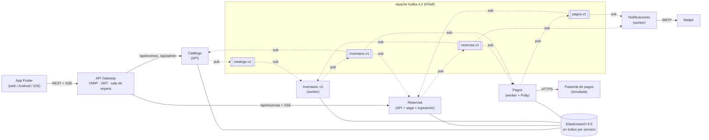
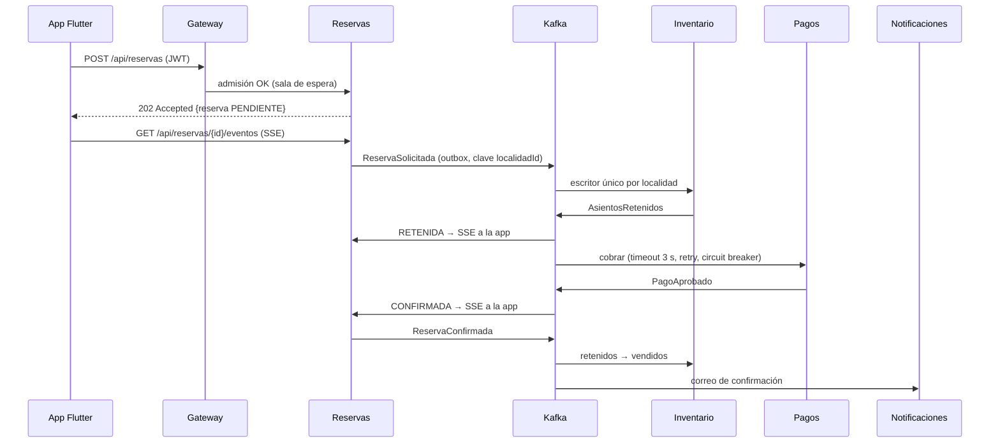

# TaquillaEDA

**Plataforma de reservas y venta de tickets para eventos construida con Arquitectura Orientada a Eventos (EDA), topología Broker.**

Taller de *Estilos arquitectónicos y stacks tecnológicos* — Arquitectura de Software, Pontificia Universidad Javeriana (2026).
Integrantes: Carlos Pinzón · Nicolás Granados · Juan Esteban.

Stack: **Flutter** (frontend) · **.NET 10 / C#** (backend) · **Elasticsearch 9.5** (persistencia) · **Apache Kafka 4.2** (integración asíncrona) · **REST + Server-Sent Events** (integración síncrona) · **Docker Compose** (despliegue).

---

## 1. Descripción del sistema

TaquillaEDA permite a un **comprador** buscar eventos (conciertos, obras, partidos), reservar de 1 a 6 cupos de una localidad, pagar y seguir en tiempo real el estado de su reserva; y a un **organizador**, publicar eventos con sus localidades. El diseño toma como referencia la arquitectura pública de Ticketmaster (Kafka como columna vertebral, sala de espera, retención temporal de asientos).

El caso de uso de extremo a extremo es **CU-01 "Reservar y pagar un ticket"**, implementado como una **saga coreografiada**: ningún servicio llama a otro; cada uno reacciona a eventos publicados en Kafka y publica nuevos hechos.



### Flujo principal (camino feliz)



### Qué demuestra la implementación

| Requisito del taller | Cómo se cumple |
|---|---|
| Mínimo 3 entidades relacionadas | Evento, Localidad, Reserva, Pago y Cliente (cada una con un servicio dueño) |
| Flujo funcional de extremo a extremo | CU-01 desde la app Flutter hasta el correo de confirmación |
| Persistencia real | Un índice de Elasticsearch por servicio + índices `<servicio>-procesados` |
| Manejo de errores y validaciones | Validación en API y en el contrato del evento, flujos alternos A1–A8, Polly, reintentos y DLQ |
| Contenedores | Todo el sistema con `docker compose up` (16 contenedores) |
| Integración entre componentes | REST, Server-Sent Events y Kafka |

Patrones aplicados: saga coreografiada con compensaciones, outbox embebido, consumidor idempotente, Dead Letter Queue, concurrencia optimista, escritor único por partición, CQRS (catálogo como vista materializada), *event-carried state transfer*, API Gateway, *rate limiting* (sala de espera), retry / timeout / circuit breaker, health checks, trazas distribuidas. Las decisiones están en [`docs/adr`](docs/adr/README.md) y los contratos de eventos en [`docs/asyncapi.yaml`](docs/asyncapi.yaml) y [`contracts/schemas`](contracts/schemas).

---

## 2. Tecnologías usadas

| Capa | Tecnología | Versión | Uso en el sistema |
|---|---|---|---|
| Frontend | Flutter / Dart | 3.47 / 3.13 | App multiplataforma (web, Android, iOS) con BLoC; REST + lectura SSE en streaming |
| Backend | .NET / C# (ASP.NET Core) | 10 LTS | Minimal APIs, Worker Services, `TypedResults.ServerSentEvents` |
| Persistencia | Elasticsearch | 9.5.4 | Un índice por servicio, agregados por documento, concurrencia optimista, búsqueda en español con facetas |
| Integración asíncrona | Apache Kafka | 4.2.2 (KRaft) | Bus de eventos: 4 tópicos de dominio (6 particiones) + 4 DLQ |
| Integración síncrona | REST/JSON + Server-Sent Events | — | Comandos y consultas; estados de la reserva en vivo |
| Gateway | YARP | 2.3 | Enrutamiento, JWT, sala de espera (rate limiting por evento), paso del stream SSE |
| Resiliencia | Polly (`Microsoft.Extensions.Http.Resilience`) | 10.10 | Timeout, reintentos con backoff y circuit breaker hacia la pasarela |
| Clientes | `Confluent.Kafka`, `Elastic.Clients.Elasticsearch` | 2.15 / 9.5.3 | Productor idempotente, consumidores por grupo, documentos versionados |
| Contratos | CloudEvents 1.0 + JSON Schema + AsyncAPI 3.0 | — | Sobre estándar de eventos y catálogo documentado |
| Observabilidad | OpenTelemetry + Aspire Dashboard | 1.19 / 13.5 | Trazas, métricas y logs; una reserva se sigue con un solo `traceId` |
| Herramientas | Kafbat UI, Kibana, Mailpit | 1.5 / 9.5.4 / 1.31 | Ver tópicos y *lag*, inspeccionar índices, ver los correos enviados |
| Contenedores | Docker + Docker Compose (o Podman) | — | Despliegue reproducible con un comando |
| Pruebas | xUnit, Testcontainers, flutter_test | — | Dominio, saga completa en memoria, integración con Kafka y Elasticsearch reales |
| CI | GitHub Actions | — | Compila, prueba y valida en cada push |

---

## 3. Pasos para despliegue

> **¿Qué es Docker?** Es una herramienta que empaqueta cada programa con todo lo que necesita (sistema operativo mínimo, runtime, librerías) en una **imagen**, y lo ejecuta aislado en un **contenedor**. **Docker Compose** lee el archivo `docker-compose.yml` y levanta todos los contenedores del sistema juntos, en una red privada, en el orden correcto. Por eso no hace falta instalar .NET, Kafka, Elasticsearch ni Flutter en tu equipo: solo Docker.

### 3.1 Requisitos

- **Docker Desktop** (Windows/macOS) o Docker Engine (Linux), con al menos **8 GB de RAM** disponibles para Docker.
- **Git**.
- Conexión a internet la primera vez (se descargan ~3 GB de imágenes; las siguientes veces es inmediato).

**Instalar Docker Desktop en Windows 10/11**

1. Abre PowerShell **como administrador** y ejecuta `wsl --install` (instala el Subsistema de Windows para Linux, que Docker usa por debajo). Reinicia el equipo si lo pide.
2. Descarga Docker Desktop desde <https://www.docker.com/products/docker-desktop/> e instálalo con las opciones por defecto (deja marcado *Use WSL 2*).
3. Abre Docker Desktop y espera a que abajo a la izquierda diga **Engine running**.
4. Comprueba en una terminal:
   ```bash
   docker --version
   docker compose version
   ```

**Instalar Docker Engine en Linux (Ubuntu / Linux Mint)**

1. Sigue la guía oficial <https://docs.docker.com/engine/install/ubuntu/> (en Mint, usa `$UBUNTU_CODENAME` como versión).
2. Para usar `docker` sin `sudo`: `sudo usermod -aG docker $USER` y **reinicia** el equipo.
3. Elasticsearch necesita `vm.max_map_count` ≥ 262144: `echo "vm.max_map_count=262144" | sudo tee /etc/sysctl.d/99-elasticsearch.conf` y `sudo sysctl --system`.

### 3.2 Levantar el sistema

```bash
git clone https://github.com/<usuario>/taquilla-eda.git
cd taquilla-eda
git checkout v1.0.0
docker compose up -d --build
```

- `--build` construye las imágenes propias (los 7 servicios .NET y la app Flutter). **La primera vez tarda entre 5 y 15 minutos** (descarga el SDK de .NET y el de Flutter dentro de Docker). Después arranca en segundos.
- `-d` (*detached*) deja todo corriendo en segundo plano y te devuelve la terminal.

Verifica el estado (espera 1–2 minutos a que todo quede *healthy*):

```bash
docker compose ps
```

Todos los servicios deben aparecer `running (healthy)`, salvo `kafka-init`, que crea los tópicos y termina con `exited (0)` (es lo esperado). Al arrancar, Catálogo carga **6 eventos de ejemplo** automáticamente.

### 3.3 Usar el sistema

| Qué | URL | Para qué |
|---|---|---|
| **App web (Flutter)** | <http://localhost:3000> | Iniciar sesión, buscar, reservar y ver la reserva en vivo |
| API Gateway | <http://localhost:8000/api/eventos> | API REST (la usa la app) |
| Kafbat UI | <http://localhost:8080> | Tópicos, mensajes, grupos de consumidores y *lag* |
| Aspire Dashboard | <http://localhost:18888> | Trazas de extremo a extremo, métricas y logs de todos los servicios |
| Kibana | <http://localhost:5601> | Documentos de Elasticsearch (Dev Tools: `GET inventario-localidades/_search`) |
| Mailpit | <http://localhost:8025> | Correos de confirmación, rechazo, expiración y reembolso |
| Elasticsearch | <http://localhost:9200> | API directa |

Recorrido sugerido:
1. Entra a <http://localhost:3000> como **Comprador** (no hay contraseñas: la identidad es simplificada para el taller).
2. Elige un evento, una localidad y la cantidad → **Reservar**. Verás los estados en vivo: *Solicitud recibida → Cupos retenidos → Procesando pago → ¡Reserva confirmada!*
3. Revisa el correo en Mailpit, los mensajes en Kafbat UI (`reservas.v1`, `inventario.v1`, `pagos.v1`) y la traza completa en Aspire Dashboard.
4. Cierra sesión y entra como **Organizador** para publicar un evento nuevo (pestaña *Publicar*).

### 3.4 Comandos útiles

```bash
docker compose logs -f reservas inventario     # ver logs en vivo (Ctrl+C para salir)
docker compose stop pagos                      # detener un servicio
docker compose start pagos                     # volver a iniciarlo
docker compose up -d --build reservas          # reconstruir un servicio tras cambiar su código
docker compose down                            # apagar todo (conserva los datos)
docker compose down -v                         # apagar todo y BORRAR los datos (Kafka y Elasticsearch)
```

La configuración de la demo (minutos de expiración, cupo de la sala de espera, fallas de la pasarela) se cambia copiando `.env.example` como `.env`. Con **Podman** funciona igual: `podman compose up -d --build`.

### 3.5 Modo distribuido (dos PCs)

Una réplica de **Inventario** y otra de **Pagos** corren en un segundo PC y se unen a los mismos grupos de consumidores que las réplicas del PC principal: Kafka reparte las particiones entre los dos equipos y, si uno se cae, se las pasa al otro sin perder reservas. Pagos del segundo PC cobra en la pasarela del PC principal (puerto 8090). **Paso a paso completo, con los escenarios de caída para la sustentación: [`GUIA-DEMO-2PCS.md`](GUIA-DEMO-2PCS.md).**

1. Los dos PCs en la **misma red** (el hotspot de un celular sirve; las redes universitarias suelen bloquear el tráfico entre equipos).
2. **PC principal:** su IP en la red local (Linux: `ip -4 route get 1.1.1.1`, el valor después de `src`; Windows: `ipconfig`). Crea `.env` con `IP_ANFITRION=<esa IP>` y ejecuta `docker compose up -d --build`. Kafka anuncia esa IP a los clientes externos y Aspire recibe trazas por el puerto 18889.
3. **Segundo PC:** crea `.env` con la misma línea `IP_ANFITRION=<IP del PC principal>` y ejecuta `docker compose -f docker-compose.nodo-remoto.yml up -d --build`.
4. **Comprobar:** `bash scripts/ver-grupos.sh` en el PC principal, o Kafbat UI → *Consumers*: `inventario` muestra 3 miembros (uno es `inventario-pc2`) y `pagos` 2 (uno es `pagos-pc2`); `docker compose -f docker-compose.nodo-remoto.yml logs -f inventario` muestra las particiones asignadas y las reservas que atiende el segundo PC; en Aspire aparece la instancia `pc2`.
5. **Tolerancia a fallos:** con `docker compose stop inventario` en el PC principal, el segundo PC atiende todas las reservas; con `docker compose -f docker-compose.nodo-remoto.yml stop` (o desconectándolo de la red: ~30 s de `session.timeout`), el PC principal recupera sus particiones.

---

## 4. Escenarios de demostración (atributos de calidad)

| Escenario | Cómo probarlo | Qué se observa |
|---|---|---|
| **No sobreventa** (100 solicitudes, 50 cupos) | Linux/macOS: `bash scripts/prueba-concurrencia.sh` · Windows: `powershell -ExecutionPolicy Bypass -File scripts/prueba-concurrencia.ps1` | Exactamente 50 CONFIRMADAS y 50 RECHAZADAS; disponibles = 0 |
| **Distribución** (dos PCs, sección 3.5) | Script de concurrencia y, a la mitad, detener el nodo del segundo PC | Kafka reasigna sus particiones; sigue sin sobreventa y ninguna reserva queda sin respuesta |
| **Sala de espera** (RF-08, A6) | El mismo script: varias respuestas `429` con `Retry-After` | La admisión se dosifica por evento |
| **Disponibilidad** (Pagos caído) | `docker compose stop pagos`, reserva en la app, espera, `docker compose start pagos` | La reserva queda RETENIDA; al volver Pagos, se confirma. 0 eventos perdidos (lag en Kafbat UI) |
| **Tolerancia a fallos** (pasarela inestable) | En `.env`: `TASA_FALLO=0.8`, luego `docker compose up -d pasarela-mock` | Reintentos con backoff; si persiste, pago rechazado y cupos liberados (A2) |
| **Pago rechazado** (A2) | Reserva 6 cupos VIP del *Festival Andino de Rock* (supera `MONTO_MAXIMO`) | RECHAZADA con "Fondos insuficientes"; cupos devueltos |
| **Sin cupos** (A1) | Abre la app en dos ventanas (una de incógnito), entra al *Palco* (4 cupos) de *Noche Sinfónica de los Andes* y reserva 3 cupos en ambas | La segunda termina RECHAZADA ("Solo queda 1 cupo") sin cobro |
| **Expiración** (A3) y **pago tardío** (A5) | `MINUTOS_EXPIRACION=1` en `.env` → `docker compose up -d`; `docker compose stop pagos`; reserva en la app; espera ~1,5 min; `docker compose start pagos` | La reserva pasa a EXPIRADA y los cupos se liberan; al volver Pagos, el cobro se cancela o, si alcanza a cobrar, se reembolsa (REEMBOLSADA) |
| **Mensaje envenenado** (A7, DLQ) | En Kafbat UI → `reservas.v1` → *Produce message* con valor `hola` | Cada consumidor lo envía a `reservas.v1.dlq` con la causa en las cabeceras `dlq-*` |
| **Modificabilidad** (consumidor nuevo) | `docker compose exec kafka /opt/kafka/bin/kafka-console-consumer.sh --bootstrap-server kafka:9092 --topic reservas.v1 --group analitica --from-beginning` | Un consumidor nuevo recibe todos los eventos sin tocar ningún servicio |
| **Observabilidad** | Aspire Dashboard → *Traces* | Una reserva se ve como una sola traza: gateway → reservas → kafka → inventario → pagos → … |

---

## 5. API

| Método | Ruta | Rol | Descripción |
|---|---|---|---|
| POST | `/api/auth/token` | — | Token JWT de demostración `{nombre, correo, rol}` (`comprador` u `organizador`) |
| GET | `/api/eventos?texto=&ciudad=&categoria=&desde=&hasta=` | — | Búsqueda con facetas (RF-02) |
| GET | `/api/eventos/{id}` | — | Detalle con disponibilidad por localidad |
| POST | `/api/admin/eventos` | organizador | Publicar evento con localidades (RF-01) |
| POST | `/api/reservas` | comprador | Crear reserva → `202 Accepted` (cabecera opcional `Idempotency-Key`); `429` si hay sala de espera |
| GET | `/api/reservas` | comprador | Mis reservas |
| GET | `/api/reservas/{id}` | comprador | Estado actual |
| GET | `/api/reservas/{id}/eventos` | comprador | Stream **SSE** con cada cambio de estado |

---

## 6. Desarrollo y pruebas (opcional, sin Docker para el código)

Requiere .NET SDK 10 y Flutter 3.47.

```bash
dotnet build TaquillaEDA.slnx
dotnet test tests/Unit/Unit.csproj             # dominio + saga completa en memoria (41 pruebas)
dotnet test tests/Integration/Integration.csproj   # requiere Docker: Kafka y Elasticsearch reales
cd app/taquilla_app && flutter test
```

App en un emulador Android contra el sistema en Docker (el emulador ve al equipo en `10.0.2.2`):

```bash
cd app/taquilla_app
flutter run --dart-define=API_URL=http://10.0.2.2:8000
```

---

## 7. Estructura del repositorio

```
taquilla-eda/
├── docker-compose.yml        despliegue completo (ADR-008)
├── docker-compose.nodo-remoto.yml   réplica de Inventario en un segundo PC (modo distribuido)
├── .env.example              configuración de la demo
├── src/
│   ├── Dockerfile            imagen multi-stage común para los servicios .NET
│   ├── Contracts/            sobre CloudEvents y records de eventos (solo DTO)
│   ├── BuildingBlocks/       pipeline de consumo, outbox, idempotencia, DLQ, OTel, JWT, health
│   ├── Gateway/              YARP + JWT + sala de espera
│   ├── Catalogo/             API de búsqueda + proyección de disponibilidad + semilla
│   ├── Reservas/             API + SSE + saga + expiración
│   ├── Inventario/           worker: Dominio / Aplicacion / Infraestructura
│   ├── Pagos/                worker + Polly
│   ├── Notificaciones/       worker + MailKit
│   └── PasarelaMock/         pasarela simulada (latencia y tasa de fallo)
├── app/taquilla_app/         Flutter (BLoC, REST, SSE) + Dockerfile con nginx
├── contracts/schemas/        JSON Schema de cada evento (v1)
├── docs/                     ADR, AsyncAPI y flujo de trabajo GitFlow
├── scripts/                  prueba de concurrencia
├── tests/Unit/               dominio y saga coreografiada en memoria
├── tests/Integration/        Testcontainers: Kafka y Elasticsearch reales
└── .github/workflows/ci.yml  integración continua
```

---

## 8. Solución de problemas

| Síntoma | Solución |
|---|---|
| `docker: command not found` / *Cannot connect to the Docker daemon* | Abre Docker Desktop y espera a *Engine running* |
| `port is already allocated` | Otro programa usa ese puerto (3000, 8000, 8080, 9200…). Ciérralo o cambia el puerto izquierdo en `docker-compose.yml` |
| Elasticsearch o Kafka se reinician | Falta memoria: Docker Desktop → *Settings* → *Resources* (o WSL) con ≥ 8 GB |
| Un servicio queda `unhealthy` | `docker compose logs <servicio>`; normalmente espera a Kafka/Elasticsearch y se recupera solo |
| La app web no carga eventos o muestra *Error 502* | El gateway no llega a Catálogo o Reservas: `docker compose ps` (deben estar *healthy*) y `docker compose logs gateway catalogo`. Tras cambiar la configuración: `docker compose up -d --build` |
| Quiero empezar de cero | `docker compose down -v` y luego `docker compose up -d --build` |
| `permission denied ... docker.sock` (Linux) | Falta el grupo `docker`: `sudo usermod -aG docker $USER` y reinicia |
| El segundo PC no conecta (modo distribuido) | Misma red, `IP_ANFITRION` correcta en los dos `.env`, y en el PC principal `docker compose up -d` después de cambiarla |

---

## 9. Flujo de trabajo

El repositorio sigue **GitFlow** (`main`, `develop`, `feature/*`, `release/*`, `hotfix/*`). Ver [`docs/gitflow.md`](docs/gitflow.md).
