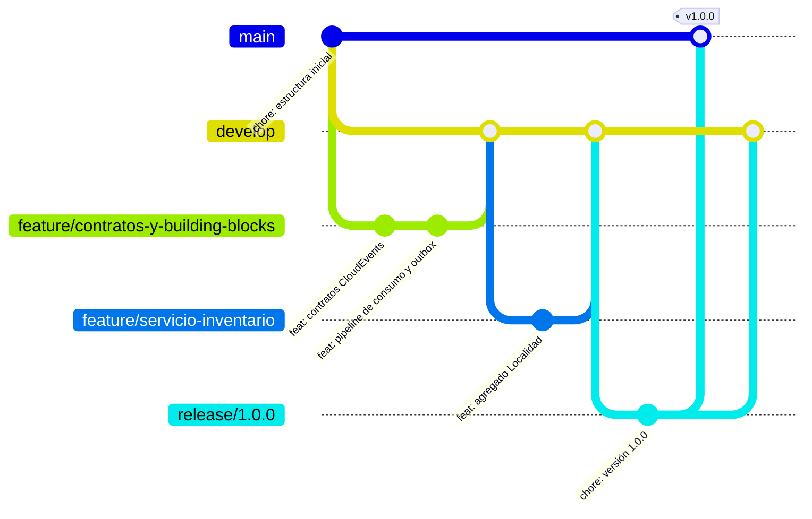

# Flujo de trabajo: GitFlow

El repositorio sigue el modelo **GitFlow** (Vincent Driessen). Ninguna funcionalidad se escribe directamente en `main` ni en `develop`: todo entra por ramas con propósito y se integra con *merge* explícito (`--no-ff`), de modo que el historial muestra cada funcionalidad como una unidad.

## Ramas

| Rama | Vida | Sale de | Se integra en | Para qué |
|---|---|---|---|---|
| `main` | permanente | — | — | Solo versiones publicadas. Cada commit de `main` tiene un *tag* (`v1.0.0`, `v1.0.1`...) |
| `develop` | permanente | `main` | `release/*` | Integración de las funcionalidades terminadas |
| `feature/<nombre>` | temporal | `develop` | `develop` | Una funcionalidad o componente (p. ej. `feature/servicio-reservas`) |
| `release/<versión>` | temporal | `develop` | `main` y `develop` | Estabilizar una versión: documentación, número de versión, correcciones menores |
| `hotfix/<versión>` | temporal | `main` | `main` y `develop` | Corrección urgente sobre una versión publicada |

## Convención de commits

Mensajes en español siguiendo *Conventional Commits*:

| Prefijo | Uso |
|---|---|
| `feat:` | funcionalidad nueva |
| `fix:` | corrección de un error |
| `test:` | pruebas |
| `docs:` | documentación |
| `build:` | Docker, compose, dependencias |
| `ci:` | integración continua |
| `chore:` | tareas de mantenimiento (versión, configuración) |

Los *merges* usan el mensaje por defecto de Git (`Merge branch 'feature/x' into develop`), que deja visible el flujo en `git log --graph` y en la vista *Network* de GitHub.

## Versionado

Versionado semántico. `v1.0.0` es la entrega del taller; el *release* de GitHub se crea sobre ese *tag* con las instrucciones del README.
